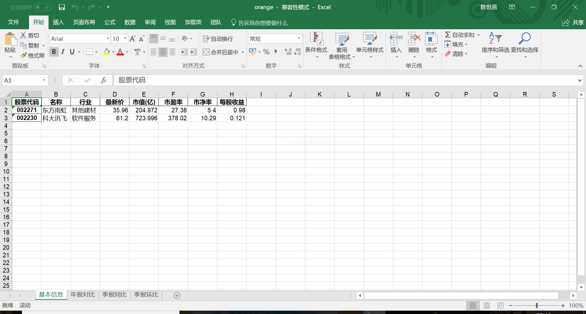
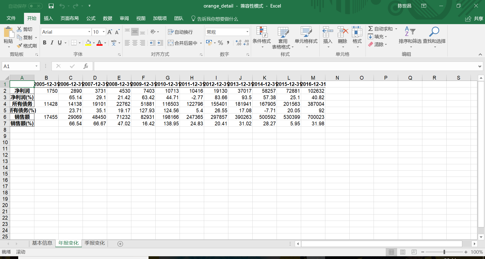
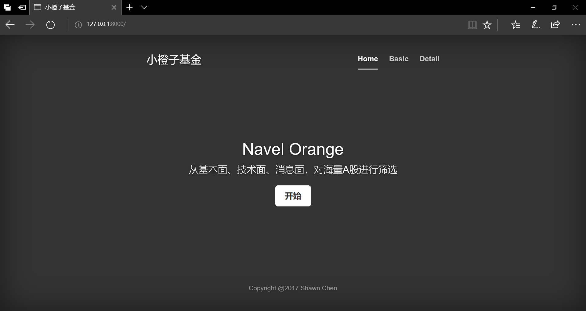
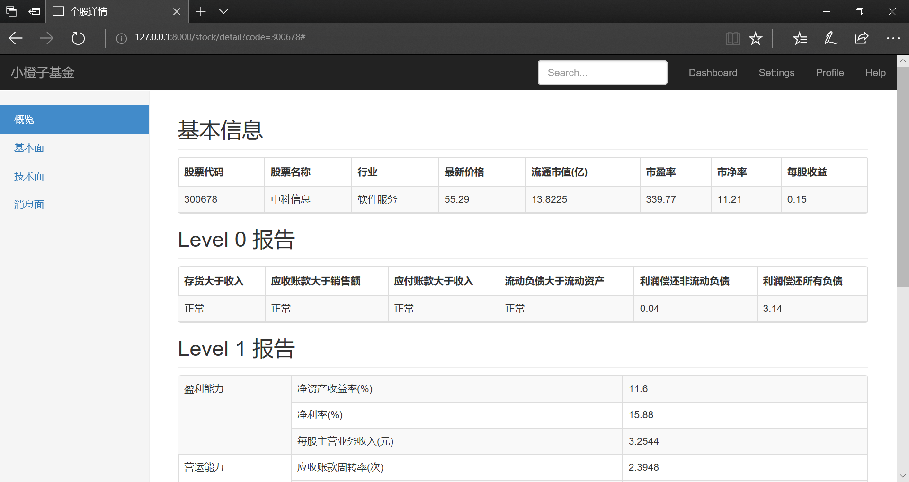
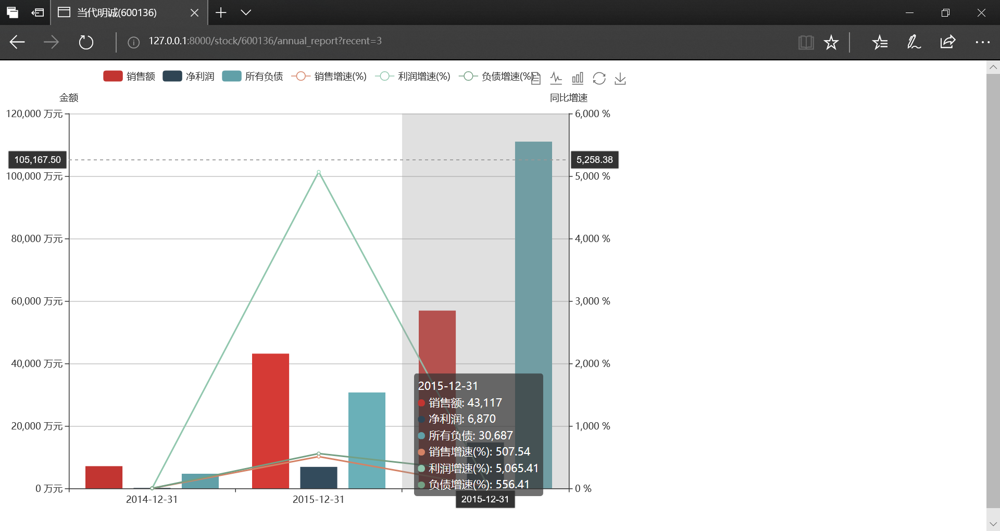
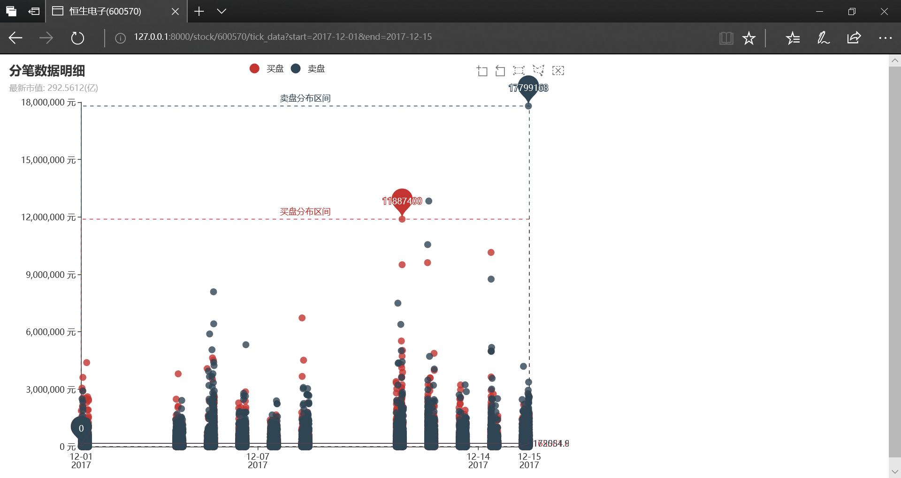

# Orange

小橙子基金主要用于股票投资，从基本面，技术面，消息面对A股市场进行筛选。

## Mandarin

获取股票的简单信息，生成到一个excel里

```cmd
orange>python mandarin.py --help
Usage: mandarin.py [OPTIONS] COMMAND [ARGS]...

  get report of stocks

Options:
  --help  Show this message and exit.

Commands:
  basic   basic report of stocks
  detail  detail report of stock

orange>
```

### basic

基础信息，支持输入一组股票代码

```cmd
orange>python mandarin.py basic 002271 002230
Done

orange>
```



### detail

详细信息，仅能输入一支股票代码

```cmd
orange>python mandarin.py detail 002271
Done

orange>
```



## Navel

股票信息查询

```cmd
orange>python manage.py runserver
Performing system checks...

System check identified no issues (0 silenced).

You have 14 unapplied migration(s). Your project may not work properly until you apply the migrations for app(s): admin, auth, contenttypes, sessions.
Run 'python manage.py migrate' to apply them.
December 16, 2017 - 20:37:06
Django version 2.0, using settings 'navel.settings'
Starting development server at http://127.0.0.1:8000/
Quit the server with CTRL-BREAK.
```









### celery

启动celery后台任务

```cmd
~/source/orange$ celery -A navel worker -l info --concurrency=10 -P gevent
/home/flychensc/anaconda3/lib/python3.6/site-packages/celery/__init__.py:113: MonkeyPatchWarning: Monkey-patching ssl after ssl has already been imported may lead to errors, including RecursionError on Python 3.6. Please monkey-patch earlier. See https://github.com/gevent/gevent/issues/1016
  monkey.patch_all()
 
 -------------- celery@flychensc-VirtualBox v4.2.1 (windowlicker)
---- **** ----- 
--- * ***  * -- Linux-4.15.0-42-generic-x86_64-with-debian-buster-sid 2018-12-10 15:10:07
-- * - **** --- 
- ** ---------- [config]
- ** ---------- .> app:         navel:0x7fcd617855c0
- ** ---------- .> transport:   redis://localhost:6379//
- ** ---------- .> results:     redis://localhost/
- *** --- * --- .> concurrency: 10 (gevent)
-- ******* ---- .> task events: OFF (enable -E to monitor tasks in this worker)
--- ***** ----- 
 -------------- [queues]
                .> celery           exchange=celery(direct) key=celery
                

[tasks]
  . navel.celery.debug_task
  . storage.tasks.update_all_history
  . storage.tasks.update_cashflow_data
  . storage.tasks.update_debtpaying_data
  . storage.tasks.update_growth_data
  . storage.tasks.update_history
  . storage.tasks.update_one_history
  . storage.tasks.update_operation_data
  . storage.tasks.update_profit_data
  . storage.tasks.update_report_data
  . storage.tasks.update_stock_basics

[2018-12-10 15:10:07,365: INFO/MainProcess] Connected to redis://localhost:6379//
[2018-12-10 15:10:07,383: INFO/MainProcess] mingle: searching for neighbors
[2018-12-10 15:10:08,463: INFO/MainProcess] mingle: all alone
[2018-12-10 15:10:08,500: INFO/MainProcess] pidbox: Connected to redis://localhost:6379//.
[2018-12-10 15:10:08,504: WARNING/MainProcess] /home/flychensc/anaconda3/lib/python3.6/site-packages/celery/fixups/django.py:200: UserWarning: Using settings.DEBUG leads to a memory leak, never use this setting in production environments!
  warnings.warn('Using settings.DEBUG leads to a memory leak, never '
[2018-12-10 15:10:08,504: INFO/MainProcess] celery@flychensc-VirtualBox ready.
```

清除celery后台任务

```
~/source/orange$ celery -A navel purge
WARNING: This will remove all tasks from queue: celery.
         There is no undo for this operation!

(to skip this prompt use the -f option)

Are you sure you want to delete all tasks (yes/NO)? 
```

## Test

执行命令`python -m unittest -v`进行单元测试

```cmd
orange>python -m unittest
test_classifier_level_report (test_stock.TestStock) ... ok
test_get_annual_report (test_stock.TestStock) ... ok
test_get_balance_sheet (test_stock.TestStock) ... ok
test_get_basic_info (test_stock.TestStock) ... ok
test_get_level0_report (test_stock.TestStock) ... ok
test_get_level1_report (test_stock.TestStock) ... [Getting data:]##########################################################[Getting data:]##########################################################[Getting data:]##########################################################[Getting data:]##########################################################[Getting data:]##########################################################ok
test_get_margin_details (test_stock.TestStock) ... [Getting data:]#5929 rows data found.Please wait for a moment.###########ok
test_get_profit_statement (test_stock.TestStock) ... ok
test_get_quarterly_results (test_stock.TestStock) ... ok
test_get_tick_data (test_stock.TestStock) ... ok
test_pct_change (test_stock.TestStock) ... ok

----------------------------------------------------------------------
Ran 11 tests in 285.514s

OK

orange>
```

## wiki

更多详情可移步[wiki](https://github.com/flychensc/orange/wiki)页面
